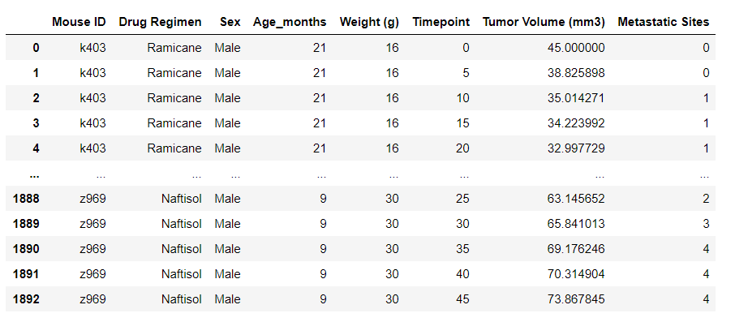
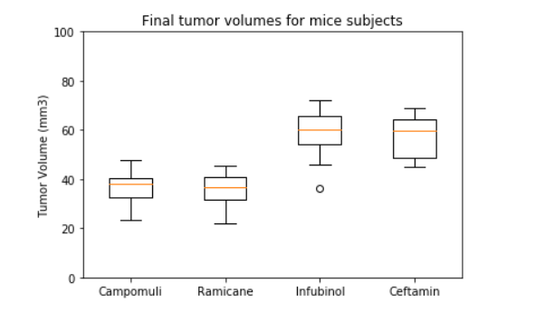
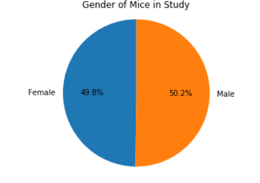
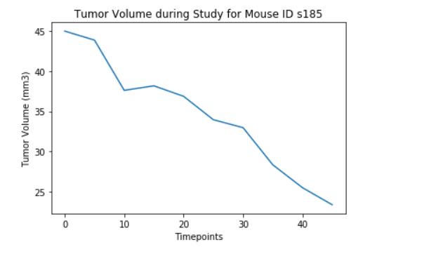
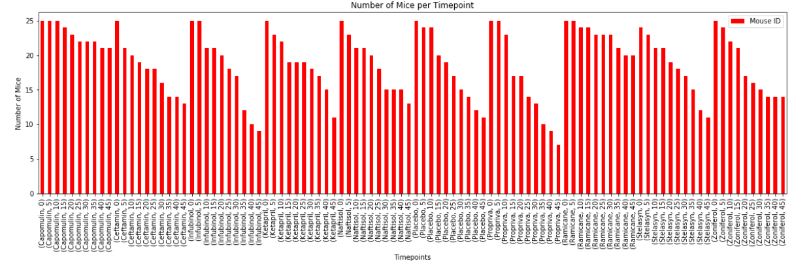
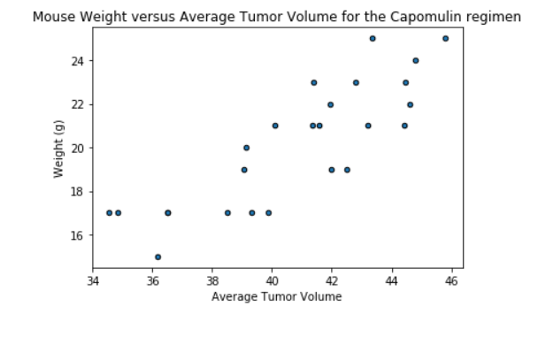
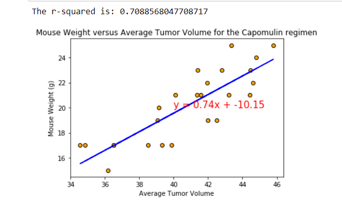
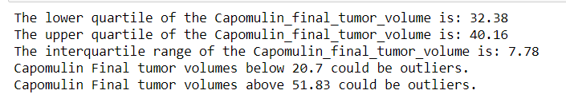
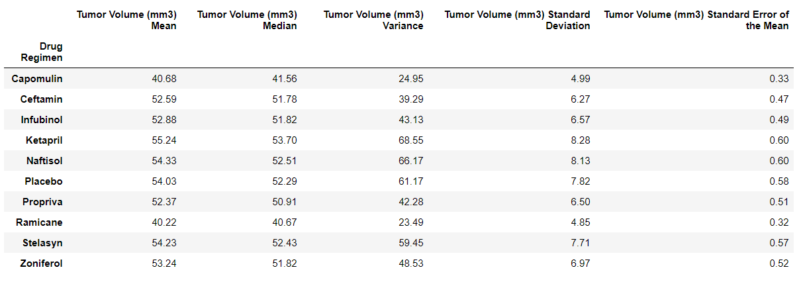

# matpoltlib_challenge
Project Description

The task is to screen potential drugs for the treatment of squamous cell carcinoma(SCC), a common form of skin cancer. The 
data used was from the most recent study using 249 mice identified as having SCC and treated with the various drugs regimens 
over 45 days. The data was then trended for reporting.

Tools Required

Pandas
Matplotlib
Python

Instructions

• Check the data for duplicate mice and remove any data associated with that mouse ID.
• Generate a summary statistics table consisting of the mean, median, variance, standard deviation, and SEM of the tumor volume for each drug regimen.
• Generate a bar plot using both Pandas and Matplotlib's that shows the number of mice per time point for each treatment regimen throughout the course of the study.
• Generate a pie plot using both Pandas and Matplotlib that shows the distribution of female or male mice in the study.
• Calculate the final tumor volume of each mouse across four of the most promising treatment regimens: Capomulin, Ramicane, Infubinol, and Ceftamin. 
Calculate the quartiles and IQR and quantitatively determine if there are any potential outliers across all four treatment regimens.
•  Generate a box and whisker plot of the final tumor volume for all four treatment regimens and highlight any potential outliers in the plot.
• Generate a line plot of time point versus tumor volume for a single mouse treated with Capomulin.
• Generate a scatter plot of mouse weight versus average tumor volume for the Capomulin treatment regimen.
• Calculate the correlation coefficient and linear regression model between mouse weight and average tumor volume for the Capomulin treatment. 

Files

Pymaceuticals_starter.ipynb – jupyter notebook containing code for plotting data and calculating statistics

Results

Box Plot

Gender pie plot (Matplotlib)

Line Graph

Bar plot for Mice vs Timepoint (Pandas)

Scatter Plot Mouse weight vs Tumor volume

Scatter plot with regression line

Statistics

